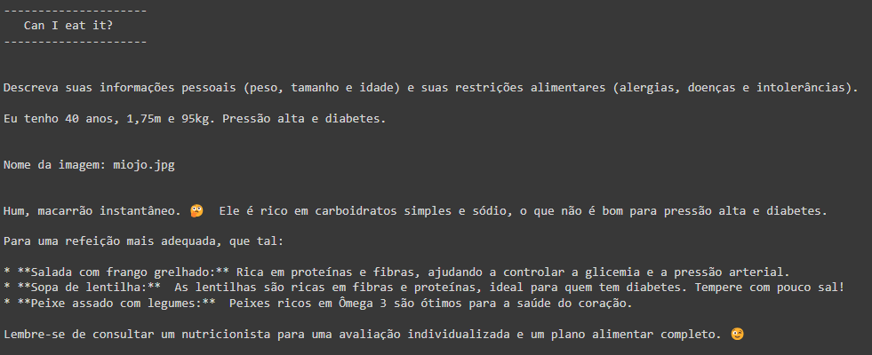
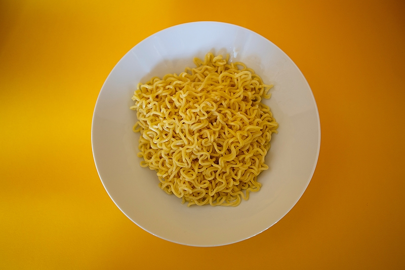

# Nutricionista Virtual por IA 🍏

A ideia é ajudar as pessoas a saber se certos alimentos são bons para elas, principalmente em relação para suas restrições. Poderiam tirar foto dos alimentos no mercado e enviar a pergunta e saberiam se podem comprar ou não p produto na hora.

## Como funciona? 🤔

O código em Python, utilizando a API da Google Gemini, cria um chatbot que simula um nutricionista virtual. Você pode enviar fotos de alimentos e o chatbot te dirá se são adequados para você, baseado nas informações sobre suas restrições que você forneceu anteriormente.

## Passo a passo 🚀
1. **Configuração:**
  * Obtenha sua chave de API da Google Gemini.
  * Defina o caminho para a pasta onde as fotos dos alimentos serão salvas no seu Google Drive.
  * Ajuste a temperatura da resposta do chatbot, se desejar.
2. **Conversa:**
  * O chatbot inicia a conversa, perguntando sobre suas restrições alimentares.
3. **Envio da imagem:**
  * Você informará o nome da imagem do alimento.
  * O código fará o upload da imagem para a API da Google Gemini.
4. **Resposta:**
  * O chatbot processará a imagem e as informações sobre suas restrições.
  * Ele te responderá, informando se o alimento é adequado para você ou sugerindo alternativas.

  

  

## Observações ⚠️
* Este projeto está em desenvolvimento e pode apresentar limitações.
* As informações fornecidas pelo chatbot não substituem o acompanhamento profissional de um nutricionista.
* É importante sempre consultar um profissional de saúde para obter orientação individualizada.

## Próximos passos 👣
* Implementar integração com outras plataformas, como aplicativos de mensagens.
* Expandir o banco de dados de alimentos e informações nutricionais.
* Permitir personalização do chatbot, com diferentes perfis de nutricionistas.

## Autor
Este código foi escrito por **Gabriel Bastos Sandim**.

## Licença
Este projeto é licenciado sob a Licença MIT. Consulte o arquivo LICENSE.md para obter detalhes.

---
